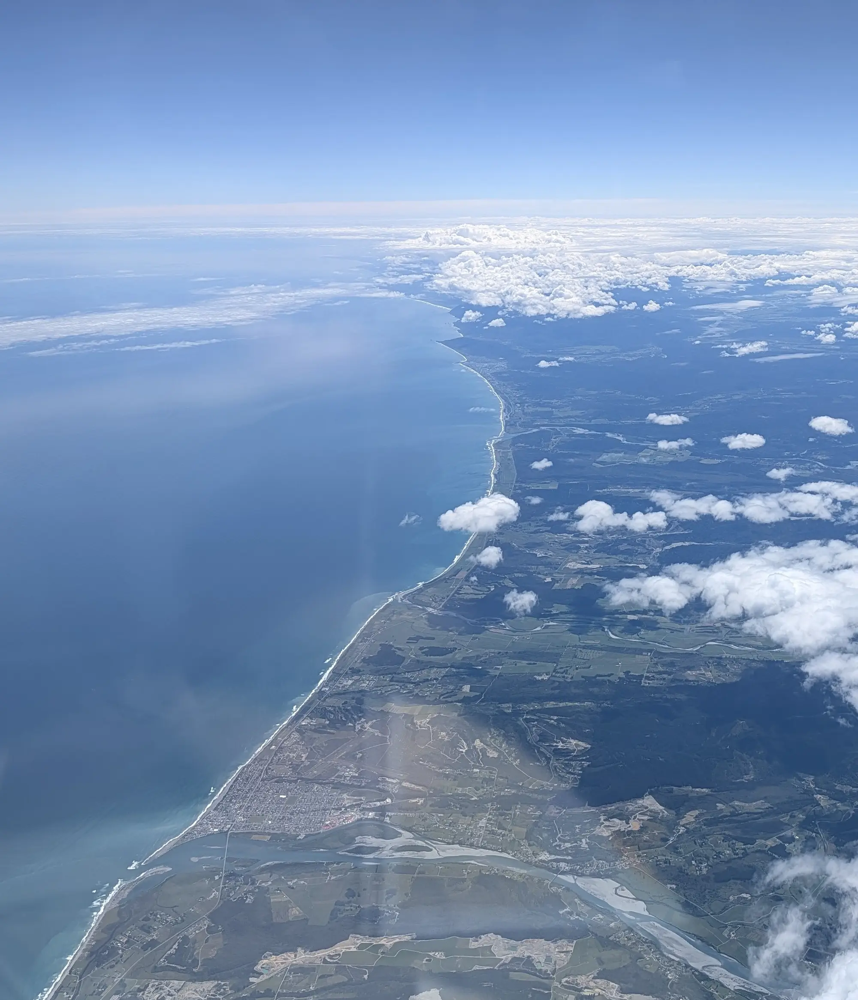
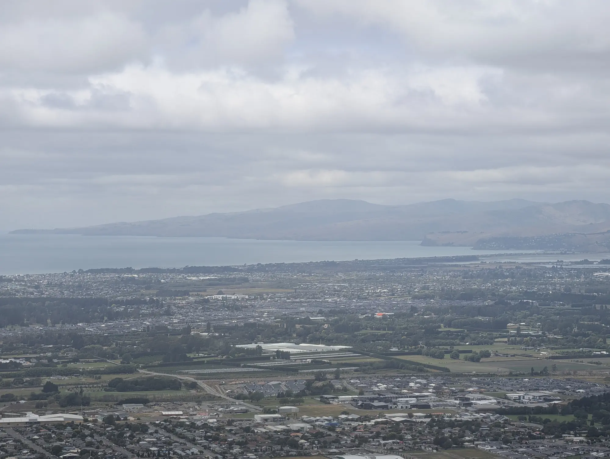

Welcome all to Alex's Big Walkabout.

The plan is to generally head north to the tip of the North Island, before generally heading south on New Zealand's Tour Ateroa (the TA). That isn't much of a plan, realistically, and that is kind of the point - to try on what it feels like to have almost no plan, and figure it out. 

I was on a plane, 30,000 feet in the air somewhere in the twilight zone of 32 hours of travel from AUS to LAX then to HKG and finally to CHC, which was an adventure all in its own.

I finally got in to Christchurch on the 3rd of January around 1300 local time.

This plane ride felt like an adventure all of its own. Finding the international terminal in LA, going through security in Hong Kong, and the many (largely unsuccessful) hours trying to sleep and forget you are awake.

Surprisingly (or maybe not) I was able to stay up long enough in the second flight, that what felt like by chance, I ended up adjusted to NZ time. I slept a bit on the, and upon waking, it happened that the sun was waking with me. Incredible!

It turns out that the approach to Christchurch flies over the Southern Alps - the large spin of mountains through the center of the island. From the plane window, I sat transfixed as wind swept ocean coastline ascended through steep canyons pained a dark green by the rainforest below.

The deep green hills were dissected by braided braided rivers colored blue from glacial flour. The terrain continued to ascend to the snowcapped, cloud kissed craggy peaks of the crest of the Southern Alps. Finally, as we dove into a bank of clouds, the mountains gave way to the expansive flatness of the Canterbury Plain. Christchurch, and it's surrounding farms, sprawled just ahead.
'Welcome to New Zealand,' I thought. 

Right about then, an announcement came over the plane's inflight video system.
"Aoteroa welcomes you" the nice kiwi in the video said, "but not your invasive plants and animals."
It turns out that somewhere around 80% of the native plants in NZ are endemic, it feels reasonable that they may ask if you have anything that may effect their unique biosphere.
In fact, so reasonable, that they demand you declare any potential pests or pest-bearing products, seeds, wood fragments, prepared food and even outdoor equipment like tents and hiking gear.

They tell you this on the plane with an inflight video, in which they ask nicely for you to do the right thing, or if you dont, they will instantly fine you $400nz before finding the next thing to do to you. To streamline the process, they provide a form, which details things like whether you have any plant material (including herbs) or animal products, or even processed food. 

Nodding to myself, I decided to adequately share that I have 2.5oz coconut oil in my bag.

The plane touched down in Christchurch to a windy grey day. We all deplane, and walk to customs by about seven different iterations of the biosecurity message on posters, highlighting their instant $400 fine for violators who do not declare.

Seeing the sign on the walk to customs reminded me that I was carrying chili flakes - herbs and seeds which MUST be declared. Of course, I had neglected to include them on my form[^1].

A small pit of dread began to fill my stomach. 
What would they do? Confiscate the items? Pull me aside and ask me where, exactly, they had come from? Would I be kicked out of the country I haven't even gotten to? Would someone tell me - finally - that this idea, to go all the way around the world and ride ~north~ was a bad idea, and I was not prepared enough to pull it off, and that infact I should find another way to get out my angst something like knitting.

Getting close to spiraling off into unrecoverable territory, and with no one else to provide any dampening, the executive functioning self grabbed the reins,
"Woahhh, there" it said, "likely the worst that will happen is they get confiscated, and you can continue. Things are going to be fine[^2]."

I que-ed and eventually arrived at the front of the line, and, clearing by dry throat, told the customs agent, as clearly as I could that I had coconut oil and chili flakes.

"Is that all you got?" Replied the customs agent
"Yeah, that's all."
"Ok" he said, "Says here you also want to declare soils?"
"Soils?" I responded, confused. "I'm not carrying soils."
"Ok..." The officer looked back at the screen.
"And what about animal products? Do you have any of those with you?"
"Uhh, no." I said, growing flustered. "It's just the coconut oil and the chili flakes?"
"Well, why did you put the other things down if you don't have them?" He asked.
I gently squirmed for a what felt like a lonnng moment before the agent laughed (at me, I am sure) and shook his head. 
"You must've selected no all the way down" he said. The implied 'you dummy' did not need to be so clearly stated.
"Alright, well just go on ahead then," he replied, waving me on.

And so on I went. In the country of New Zealand.

This was an off-putting moment for me. I had, in fact, been thinking a lot about this form on the plane. The flight attendant handed me a paper copy, and, after filling it out, I decided to switch to the online version after I had made a mistake. I thought through how exactly I would ensure that no matter what they knew what I was carrying.
I am sure in filling out the form I must have missed something - I made too many mistakes for carelessness to be ruled out as a cause - but I did try my best to ensure transparency.
But, apparently all in vain. It felt that I was wasting the guys time, not that I was doing my best to ensure the requested transparency.

The reader may admonish me saying, "relax Alex, it's just a customs official. Plus, you did exactly what you set out to do - make sure they knew you were carrying some food." Dear reader, you are absolutely correct.
And at the same time, the moment stuck with me. It highlighted for me that I did not know how to apply my effort to get the outcome I wanted, and more troubling, that I wasn't even sure what outcome I even wanted in the first place.

Next order of business: Uber to my hotel.

I called the Uber, and waited. Licence plate number: 'ADHIL', white Prius. I waited a bit longer, and then checked the driver's location - apparently he was right there. No 'ADHIL', but a white Prius sat at the curb about 15 feet away. I rechecked the app once again.
Licence plate number: NL6G79
Driver Name: ADHIL
I waved to the white Prius next to me.

My driver, Adhil, got out to get my bags. We loaded my enormous bike case into his car, and the duffel I had as well. Then I walked to the passenger side (the cars right side) and was quite surprised to find that 1) there was a steering wheel, and 2) Adhil was looking at me, head cocked.
'Oh right, they drive on the other side of the road' I thought, closing the door. I laughed, a bit embarrassed, and went to the other side.

I think of myself as a detail oriented person who is able to navigate well the environment and situation around me to get what I want. In my home context, I am used to about a 100% hit rate. The occasional mistakes are few and far between and often out of my control. In my home context - the place that I know - I am well fit to the environment, and so I am confident and in control.
But, across the world, in NZ, I had been instantly sat right back down by that same confidence by silly and preventable mistakes.

The day continued with the same vibe, to a lesser extent - small errors making it quite clear that I did not, in fact, have my shit together as much as I thought I did. Every flinch as my Uber driver made a left turn into the left lane reminded me of that. Every moment I smiled and nodded as I translated the Kiwi into American. Every time I was surprised or caught off guard reminded me that, even if NZ felt similar to where I am from, the place was actually quite different.

Was I loosing my edge? Was I just going to keep making mistakes the WHOLE time I was here? Sitting in the car, the worry began to naw at me.

What has become clearer since us that my context has changed, and with its transition, my fitness to it. I am no longer able to be as confident from prior experience as I can be in the comfortable place - or I can be as confident, but I am more likely to either make a fool out of myself or do something wrong. The solution is likely to ask for more help sooner. 

I think that this is what growth is - finding yourself in an uncomfortable place where you must adapt to a new situation and its own particular excentricities and uniquenesses. I think that this surprise is maybe what we loose when we grow accustomed to a place, and something we gain when we travel somewhere new. 

I think it's probably worth it, even if it's uncomfortable sometimes. Shaking things up is certainly why I am here.

Happy trails! More to come. Alex.

## Footnotes:

[^1]: Though, it is not like I was required to write down all the things I was bringing, just flag all the major categories I had with me.

[^2]: Having the flakes confiscated would suck. I collected the chili flakes from wild growing Christmas Light pepper plants (known better as Chili Pequin) and processed the shockingly hot peppers into flakes for use later. The spice density is unmatched. Their loss would have been unfortunate, and they could not be matched 1:1 in NZ.
